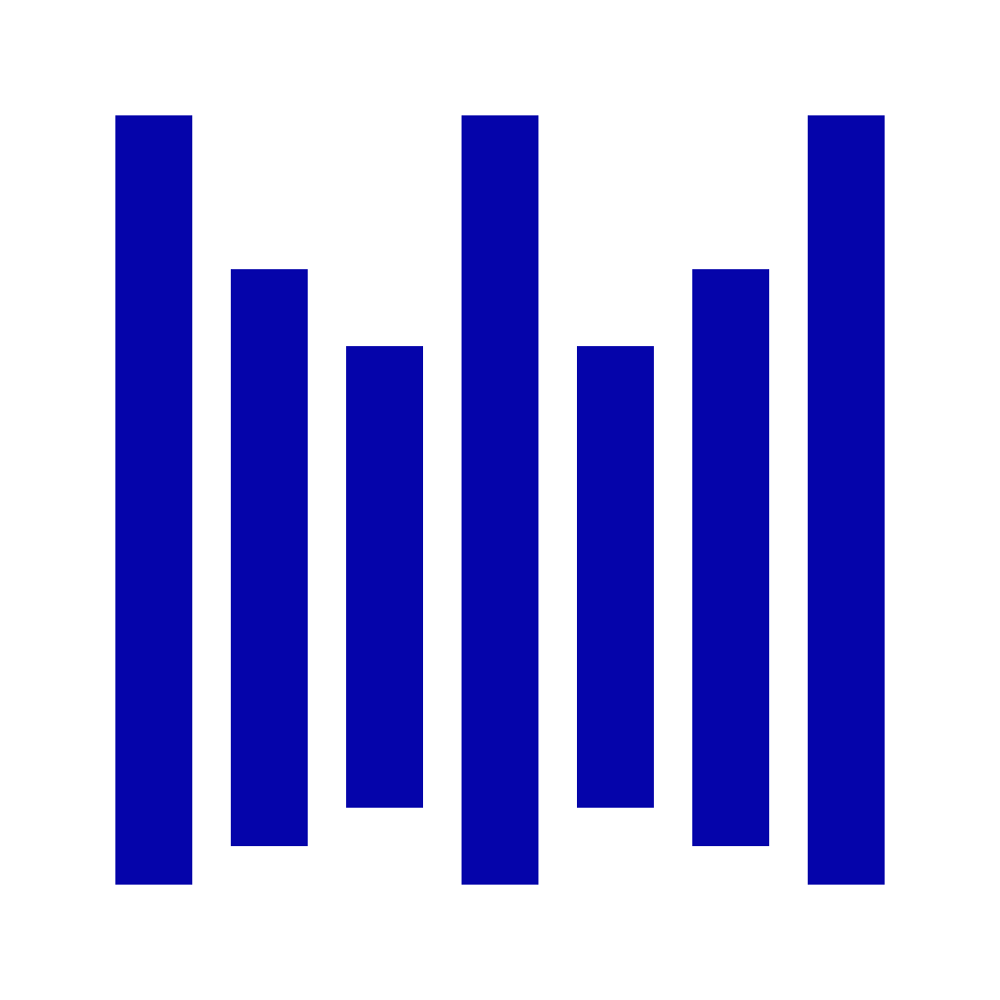

[](http://www.apache.org/licenses/LICENSE-2.0)
[](https://creativecommons.org/licenses/by-sa/4.0/)


### 🛡️ Sentinez
WAAS // WAF as a Service

> [!WARNING]
> Please keep in mind that ***Sentinez*** is still under active development
> and therefore full backward compatibility is not guaranteed before reaching v1.0.0.

#### Overview
**[SYSTEM ARCHITECTURE](./docs/i18n/en/system-architecture.md)**

----

**Main features** of *Sentinez* WAF as a service:
- Rule-based request filtering (based on OWASP CRS basics)
- Edit, import, and export rules
- Whitelist/blacklist configuration
- Realtime logs of rejected requests
- Provides a console interface for data visualization

#### How to Build and Run

**Requirements** before build and run:
- NodeJS 20.9.0
- Go 1.24.2
- Protocol Buffer
- Make (for running commands efficiently)

Clone source code with command:
```sh
git clone --recurse-submodules https://github.com/sentinez/sentinez.git $GOPATH/src/github.com/sentinez/sentinez
``` 

If you have already cloned the repo, you can initialize the submodule with:

```sh
git submodule update --init --recursive
```

> [!NOTE]
> You can view mirror project from:
> https://gitlab.com/sentinez/sentinez.git

**Run** the project with `apiserver`
```sh
make apiserver.run
```

### License

Copyright (c) Sentinez Labs. All rights reserved.

Licensed under the [Apache 2.0](LICENSE) license.

### Logo

<p align="left">
  
  
  
  
</p>

  
**Sentinez** – photo by **Duc-Hung Ho**  
Licensed under [CC BY-SA 4.0](https://creativecommons.org/licenses/by-sa/4.0/)

---
> **[© 2025 SENTINEZ](MADEINVIETNAM.md)** VN/CN/RU/IN/KR/US/JP/AU/FR/MY/NZ/ID/SG/TH